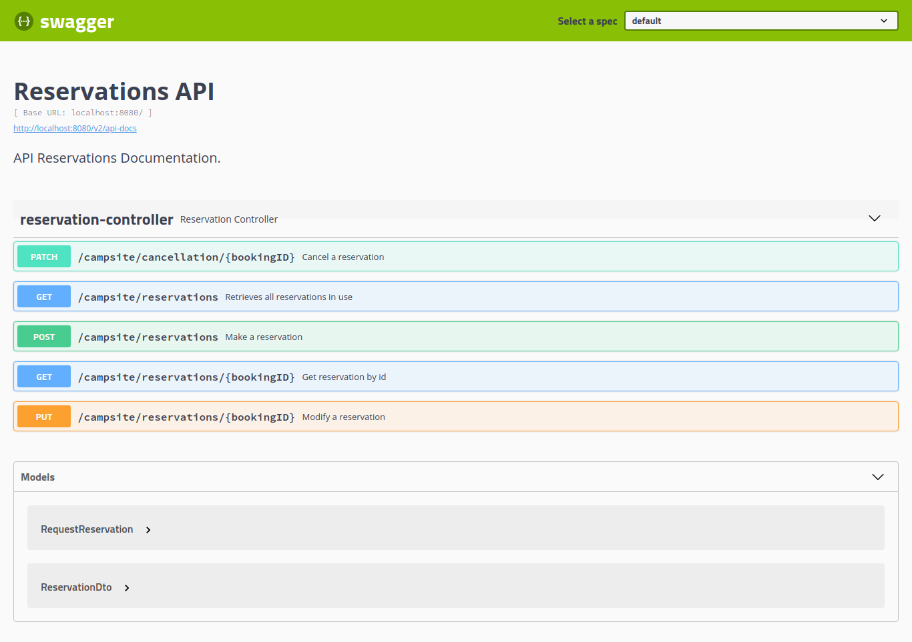

# Introduction 
Campsite application is running on port 8080 by default.

# Getting Started

To start the Campsite application
---

1. Make sure you've installed Open JDK 11: https://jdk.java.net/java-se-ri/11
2. Run `mvn clean install` to build your application
3. Start application with `java -jar target/campsite-0.0.1-SNAPSHOT.jar`
4. To check that your application is running through swagger, go to url `http://localhost:8080/swagger-ui.html`

5. To check H2 online database, go to: http://localhost:8080/h2 and click "Connect". Username `sa`, and empty password.

NOTE: There are 10 reservations as maximum allowed for this application, which can be changed in the DB table CONFIG, field MAX_RESERVATIONS.
The test DB has 5 reservations configured as maximum. Both configurations can be changed in the corresponding data.sql file(s).

## Test profile to use in test classes using in-memory h2 database
### How to run
    `mvn clean test` or `mvn clean test -Dspring.profiles.active=test`

